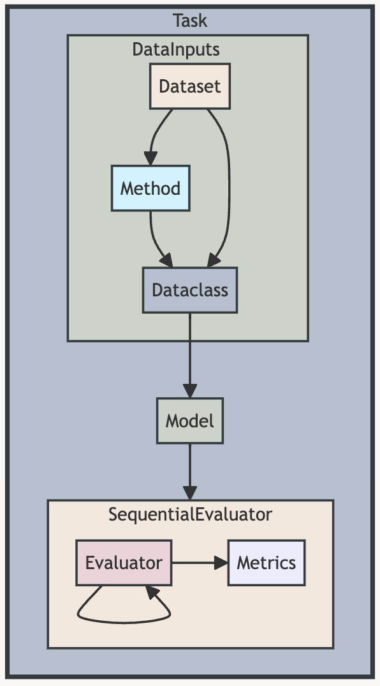

# Structure


## Project Structure

```
./
├── mmte
│   ├── __init__.py
│   ├── configs
│   │   ├── datasets/*.yaml
│   │   ├── models/**/*.yaml
│   │   └── task/**/*.yaml
│   ├── datasets
│   │   ├── __init__.py
│   │   ├── base.py
│   │   └── *.py
│   ├── evaluators
│   │   ├── __init__.py
│   │   ├── base.py
│   │   ├── metrics.py
│   │   └── *.py
│   ├── methods
│   │   ├── __init__.py
│   │   ├── base.py
│   │   └── *.py
│   ├── models
│   │   ├── [model_dependence]
│   │   ├── __init__.py
│   │   ├── base.py
│   │   └── *.py
│   ├── tasks/base.py
│   └── utils/
├── scripts/
│   ├── run/
│   └── score/
├── docs/
├── data/
├── env/
├── LICENSE
├── README.md
└── run_task.py
```

## <a name="flow"></a> Task Workflow

<figure markdown="span">
  { width="300" }
  <figcaption>Task Workflow</figcaption>
</figure>

The basic workflow of a task in MMTrustEval follows the pipeline above. The image-text pairs (or text-only samples) are retrieved from the customized `dataset`. They are likely to be further processed with a pre-defined method (e.g., pairing text with synthesized images, imposing adversarial noises to the images) by `method_hook` passed into the dataset. Data in multiple modalities is gathered into a dataclass, `TxtSample` or `ImageTxtSample`.  The samples ready for inference are then input to MLLMs with unified interface for `chat`. Further, the generated content is processed by diverse `evaluators` (e.g., keyword extraction, GPT-4 rating, classifier) and further standardized to be computed with specified `metrics` (e.g., accuracy, pearson correlation coefficient).
